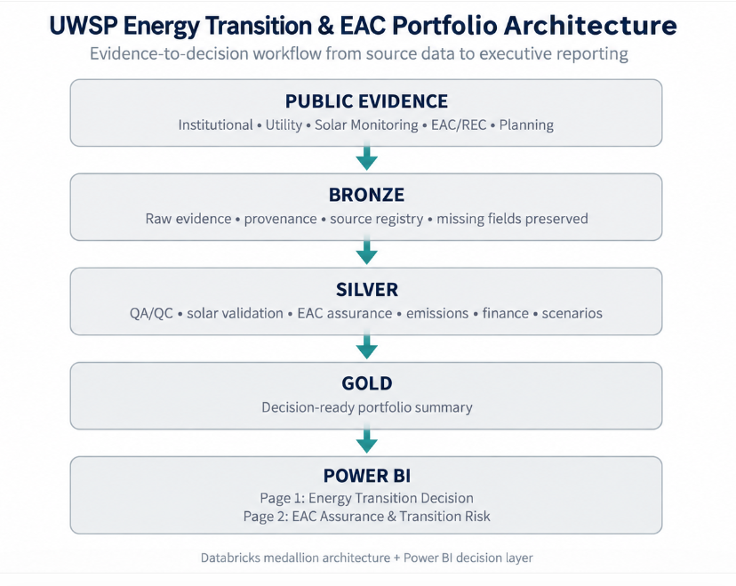
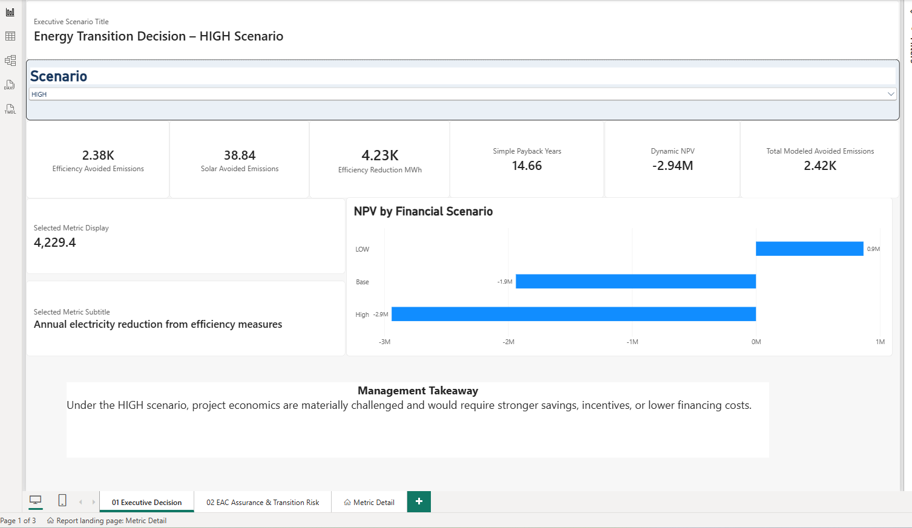
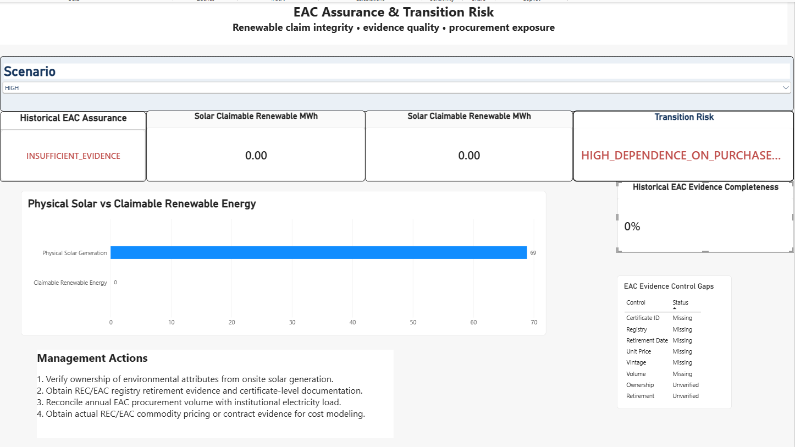

# UWSP Energy Transition & EAC Portfolio

A decision-support case study integrating energy efficiency, onsite solar,
Environmental Attribute Certificates (EACs), Scope 2 considerations,
financial scenario analysis, evidence assurance, and transition risk using
Databricks and Power BI.

## Business Question

How should an institution combine energy efficiency, onsite renewable
generation, and environmental attributes while managing:

- cost
- claim integrity
- evidence quality
- financial performance
- transition risk

## End-to-End Architecture

Public Evidence → Bronze → Silver → Gold → Power BI



### Bronze
Preserves source evidence, provenance, and missing fields.

### Silver
Applies QA/QC, emissions modeling, EAC assurance, financial analysis,
reconciliation, and transition-risk logic.

### Gold
Provides decision-ready outputs for Power BI.

### Power BI
Translates the Gold layer into executive decision support.

---

## Page 1 — Energy Transition Decision Dashboard



This page focuses on the financial and environmental performance of the
energy-transition portfolio.

### Key Findings

- Energy-efficiency reduction: approximately **4,229 MWh/year**
- Modeled electricity-related avoided emissions: approximately **2,385 tCO2e/year**
- Annualized onsite solar generation: approximately **68.89 MWh/year**
- Simple payback: approximately **14.66 years**

Financial results vary materially by scenario:

| Scenario | NPV |
|---|---:|
| LOW | +$0.87M |
| BASE | -$1.94M |
| HIGH | -$2.94M |

The analysis demonstrates that project economics depend strongly on
financing assumptions and future energy-price conditions.

---

## Page 2 — EAC Assurance & Transition Risk



This page evaluates whether renewable-electricity claims can be supported
by the evidence currently assembled.

### Key Findings

- Annualized physical solar generation: **68.89 MWh**
- Claimable renewable electricity based on currently verified ownership evidence: **0 MWh**
- Historical EAC assurance status: `INSUFFICIENT_EVIDENCE`
- EAC commodity-price readiness: `COMMODITY_PRICE_EVIDENCE_REQUIRED`
- Transition-risk status: `HIGH_DEPENDENCE_ON_PURCHASED_EACS`

The model deliberately separates:

**physical generation → attribute ownership → retirement → claim eligibility**

Missing certificate-level evidence is flagged rather than invented.

---

## Decision Controls Demonstrated

The project includes controls for:

- source provenance
- source freshness
- solar physical plausibility
- EAC / REC ownership
- certificate retirement
- evidence completeness
- emissions calculations
- reported-versus-modeled reconciliation
- financial scenario analysis
- transition-risk classification
- procurement data requests

---

## Technology Stack

- Databricks
- Delta Lake
- SQL
- Medallion Architecture
- Power BI
- DAX
- Power Query

---

## Repository Structure

```text
.
├── README.md
├── assets/
│   ├── executive-dashboard.png
│   ├── eac-assurance-dashboard.png
│   └── architecture.png
├── databricks/
├── power-bi/
├── methodology/
│   ├── data-lineage.md
│   ├── eac-assurance-methodology.md
│   ├── financial-scenarios.md
│   └── assumptions-and-limitations.md
└── sources/
    └── source-register.md